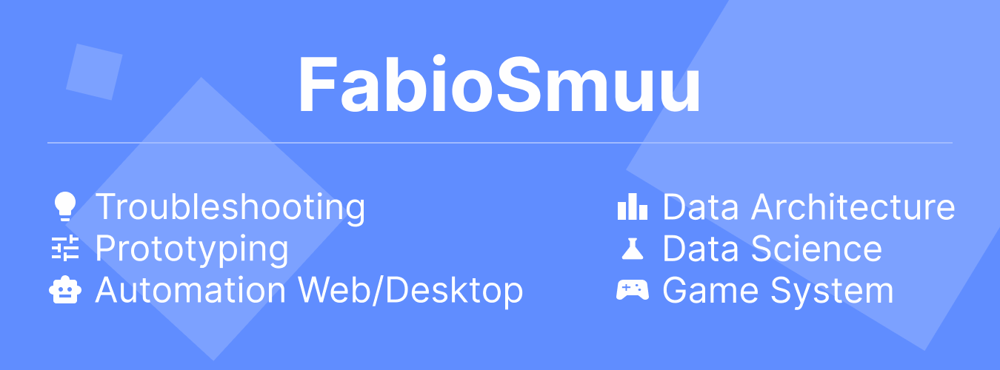

> Sou Desenvolvedor back-end, focado em engenharia e arquitetura de Softwares, Aplicações, Bots(Robôs), APIs, Plugins/addons, Módulos, Bibliotecas, Prototipagens, IAs e Manipulação/Estrutura de dados.
 

  
[Spoiler] Como comecei?

 
 ---

Estou desde 2012 estudando por conta própria e sempre buscando cada vez mais conhecimento, buscando ao máximo novas experiencias, projetos, desafios, novidades e me descobrir cada vez mais.

 Comecei na área através de um computador bem atiguinho sem internet, onde só tinha joguinhos e o mspaint, então sempre busquei algo novo para fazer.... e foi ai que minha paixão começou, quando encontrei a system32 e as variações de extensões como *cmd, bat, vbs* e até mesmo *ini*.

 Com o tempo, fui tentando entender como estes arquivos se comportavam e para que servia, mas para isso eu tinha de ficar indo na lan house para pesquisar, desde então comecei a tentar montar meus próprios "programinhas" com base no que eu aprendia.

 Fiquei por um bom tempo criando interfaces em hta com a back-end em *vbs* até descobrir que existia *vb, pascal e c#*, e a partir dai, comecei a brincar com desenvolvimento de software, fazendo alguns forms para contabilizar o consumo de água do condomínio onde morei, por exemplo.

Hoje em dia me impressiono com o tanto que a tecnologia veio crescendo e tomando esta proporção enorme como, por exemplo, a área de data science.

> E foi assim que comecei a me tornar o que sou hoje.

**Obrigado pela atenção.**

 ---

 

# Conheça meus modulos.
Atualmente possuo alguns módulos desenvolvidos e que podem ser explorados através de npm ou yarn.

Modulo|Descrição|Comando|Versão|Downloads
-|-|-|-|--
[stredit](https://www.npmjs.com/package/stredit)|Este modulo foi desenvolvido para facilite a customização do console do Node.js|` npm i stredit`||
[artificial.js](https://www.npmjs.com/package/artificial.js)|Crie redes neurais, inteligencias e qualquer outra automação artificial com esta poderosa biblioteca. |`npm i artificial.js`| | 
 

Acesse: https://artificial.js.org/reference para consultar a documentação do projeto.

 
 
 

###
:electric_plug: **Tecnologias de uso recorrente**:

![Artificial.js](https://img.shields.io/badge/-artificial.js-608dff?style=for-the-badge&logoColor=white&logo=data:image/svg+xml;base64,PHN2ZyB3aWR0aD0iNDgiIGhlaWdodD0iNDgiIHZpZXdCb3g9IjAgMCA0OCA0OCIgZmlsbD0ibm9uZSIgeG1sbnM9Imh0dHA6Ly93d3cudzMub3JnLzIwMDAvc3ZnIj4KPGcgY2xpcC1wYXRoPSJ1cmwoI2NsaXAwXzE4XzM4MykiPgo8bWFzayBpZD0ibWFzazBfMThfMzgzIiBzdHlsZT0ibWFzay10eXBlOmx1bWluYW5jZSIgbWFza1VuaXRzPSJ1c2VyU3BhY2VPblVzZSIgeD0iMCIgeT0iMCIgd2lkdGg9IjQ4IiBoZWlnaHQ9IjQ4Ij4KPHBhdGggZD0iTTQ4IDBIMFY0OEg0OFYwWiIgZmlsbD0id2hpdGUiLz4KPC9tYXNrPgo8ZyBtYXNrPSJ1cmwoI21hc2swXzE4XzM4MykiPgo8cGF0aCBkPSJNMzEuMDEwOSAxNi40Mzg3TDQ3LjEzMTMgNDQuMTkwOUgzNC41ODY3TDI0LjQyNDcgMjcuODM2NUwyNCAyNy4xNTNMMjMuNTc1MyAyNy44MzY1TDEzLjQxMzMgNDQuMTkwOUgwLjg2OTU0MUwxNi44ODM2IDE2LjY3N0wxNy4wMjIxIDE2LjQzOUwxNy4wMjgyIDE2LjQyODVMMTcuMTczNyAxNi4xNzg1TDI0LjAwMSA0LjQ0ODMyTDMxLjAwNTUgMTYuNDI5M0wzMS4wMTA5IDE2LjQzODdaIiBzdHJva2U9IndoaXRlIi8+CjxwYXRoIGQ9Ik0yNCAzLjQ1NTk5VjI4LjEwMDNMMTMuNjkxMyA0NC42OTA5SDBMMTYuNTg5OSAxNi4xODc1TDE2LjU4MzQgMTYuMTc3SDE2LjU5NjFMMjQgMy40NTU5OVoiIGZpbGw9IndoaXRlIi8+CjxwYXRoIGQ9Ik0yNCAyOC4xMDAzTDM4LjgxODggMjIuNjIzN0wzNC4zMDg3IDQ0LjY5MDlMMjQgMjguMTAwM1oiIGZpbGw9IndoaXRlIi8+CjwvZz4KPC9nPgo8ZGVmcz4KPGNsaXBQYXRoIGlkPSJjbGlwMF8xOF8zODMiPgo8cmVjdCB3aWR0aD0iNDgiIGhlaWdodD0iNDgiIGZpbGw9IndoaXRlIi8+CjwvY2xpcFBhdGg+CjwvZGVmcz4KPC9zdmc+Cg==)

 
 

###
:electric_plug: **Tecnologias já exploradas**:

 
 

### :mailbox_with_mail: Contato
#### E-mail: fabio.inc.contato@gmail.com

- [  Itchi.io](https://deehleh.itch.io)

 
 

